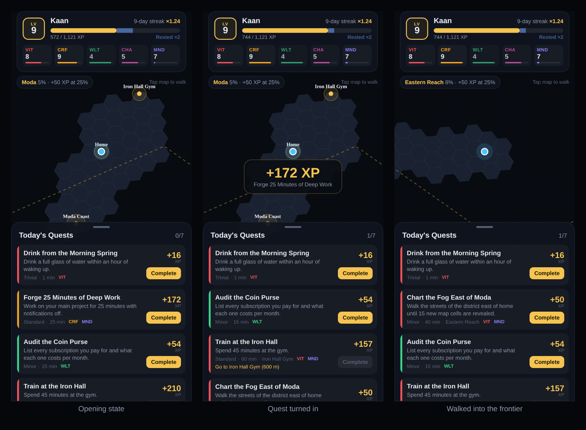

# Life Quest app

Expo (SDK 57, React Native 0.86) client. One screen so far: the map HUD with fog of war, the XP bar and skill chips, and today's quest log.



## Run it

```bash
npm ci --prefix ..   # the engines in ../src are imported from source
npm ci
npx expo start       # press i / a for a simulator, or scan the QR code with Expo Go
npx expo start --web # browser preview
```

Without a Mapbox token, or inside Expo Go, the map is an SVG renderer that draws the real H3 cells and the real `fogMask()` geometry over a plain grid. To get Mapbox tiles, set a public token and use a development build, because `@rnmapbox/maps` is a native module Expo Go doesn't include:

```bash
EXPO_PUBLIC_MAPBOX_TOKEN=pk.... npx expo run:ios   # or run:android
```

## How to play the mock

- **Complete** turns a quest in. The XP shown on each card comes from `computeAward()` with the player's live streak, rested pool, skill Form and daily caps, so it changes as you play (the rested pool doubles awards until it runs dry).
- **Tap the map** to walk there. The walk is simulated GPS: one fix every 10 s at 1.4 m/s, run through `validateFixes()` and `revealCells()` just like the server will run real fixes.
- **Tap a quest with a place** to frame it on the map. Gym and coast quests unlock only inside the waypoint's radius; the exploration quest unlocks after 15 new cells in the frontier district.

## Layout

| Path | What |
|---|---|
| `src/game/session.ts` | Pure game state: award preview, quest gates, completion, walking, HUD view model |
| `src/game/mock-world.ts` | Seed player, waypoints and a quest batch that passes the generator's schema and `validateBatch()` |
| `src/ui/` | `GameScreen`, `HudHeader`, `XpBar`, `QuestList`, `Toast` |
| `src/ui/map/` | `PlaceholderMap` (SVG), `MapboxMap` (native), shared props |
| `metro.config.js` | Watches `../src` and resolves its imports from this app's `node_modules` |

```bash
npm run typecheck
npm test              # vitest: session logic + mock batch contract
npm run bundle:check  # Android bundle, catches Metro resolution errors
```
