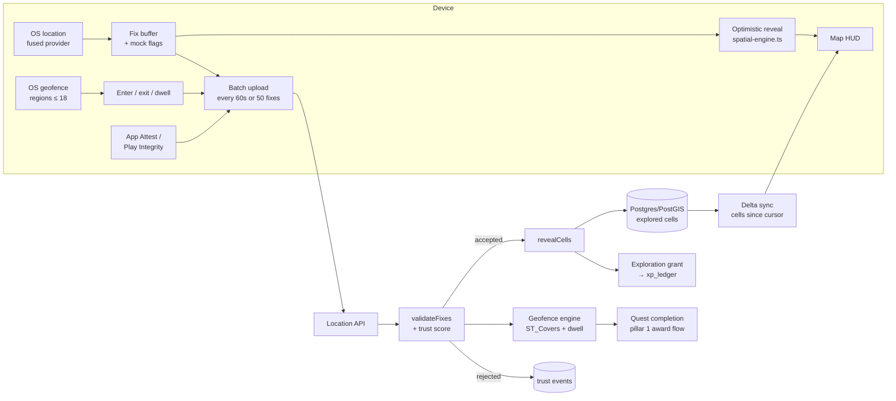

# Life Quest — Pillar 2: Spatial Architecture

Status: v1 draft · Reference implementation: [`spatial-engine.ts`](../src/spatial/spatial-engine.ts) (h3-js v4, smoke-tested on Node 22) · Builds on [pillar 1](./pillar-1-data-models-xp.md)

## 0. Design principles

1. **Hexes, not pixels.** Fog of war is a set of H3 cells per player, not a raster or a polyline buffer. Sets are tiny, diffable, sync cleanly and aggregate up for free (cell → district → city).
2. **Server-authoritative, client-optimistic.** The client reveals fog instantly for feel; the server re-validates the track and is the only one that grants XP. Rejected reveals quietly re-fog on next sync.
3. **Raw location is toxic waste.** Keep it briefly, keep derived data (cells, geofence events) long. Home is never shown to anyone.
4. **Battery is a feature.** High-accuracy GPS only when the map is open or a location quest is active. Everything else rides OS geofencing and significant-change.
5. **Trust feeds the economy.** Anti-spoofing doesn't ban; it downgrades verification (pillar 1 `M_verify`: sensor 1.15 → self 0.7), which removes the incentive to cheat.

## 1. Spatial resolutions

| Purpose | H3 res | Edge | Area | Notes |
|---|---|---|---|---|
| Fog cell | 10 | ~76 m | ~1.5 ha | Unit of exploration. A city block. |
| District | 7 | ~1.4 km | ~5.2 km² | 343 fog cells; completion milestones |
| Sync / render tile | 5 | ~9.9 km | ~250 km² | Client caches fog geometry per tile |

Reveal radius depends on speed (from validated fixes):

| Speed | Mode | Reveal |
|---|---|---|
| ≤ 8 m/s | walk / run / bike | `gridDisk(cell, 1)` = 7 cells, ~130 m radius |
| 8–40 m/s | car / bus | current cell only |
| > 40 m/s | train / plane | nothing |

Consecutive fixes are joined with `gridPathCells` (capped at 30 cells) so a 10-second fix interval at running pace leaves no holes. Smoke test: a simulated 20-minute, 2.6 km walk revealed 46 cells (13% of one district).

## 2. Location pipeline



Location modes:

| Mode | When | iOS | Android |
|---|---|---|---|
| Passive | App backgrounded, no active location quest | Significant-change + region monitoring | Geofencing API + passive provider |
| Active | Location quest in progress, or a run/walk session | `CLLocationManager` best accuracy, 10 m distance filter, background location | Fused provider, `PRIORITY_HIGH_ACCURACY`, 5–10 s interval, foreground service |
| Map open | HUD visible | Best accuracy | High accuracy |

**OS geofence budget:** iOS caps an app at 20 regions, Android at 100. We register the **18 nearest** relevant geofences (home, work, active quest waypoints, nearest boss arena), reserving 2 slots, and re-rank on every significant-change event.

## 3. Anti-spoofing and trust

Layered, cheapest first. Implemented in `validateFixes()`:

| Layer | Signal | Action |
|---|---|---|
| OS mock flag | Android `Location.isMock()`, iOS 15+ `sourceInformation.isSimulatedBySoftware` | Reject fix |
| Clock | Fix timestamps in the future (> 60 s) or out of order | Reject fix |
| Accuracy | Horizontal accuracy > 50 m | Drop silently (not suspicious) |
| Velocity | > 85 m/s (~300 km/h) between fixes. Exception: > 30 min gap under 280 m/s counts as a flight | Reject fix |
| Signal realism | ≥ 20 fixes with identical accuracy and altitude (spoof apps replay clean data) | Reject batch |
| Device integrity | App Attest (iOS) / Play Integrity (Android) token on each upload, verified server-side | Fail → cap trust at 0.5 |

Each batch yields a `suspicion` score in [0, 1]. The player's **trust score** is an exponential moving average:

$$\text{trust}_{t} = 0.9 \cdot \text{trust}_{t-1} + 0.1 \cdot (1 - \text{suspicion})$$

Starting trust is 0.8. Effect on pillar 1:

| Trust | Sensor-verified quests pay as | Exploration XP |
|---|---|---|
| ≥ 0.7 | `sensor` (1.15×) | full |
| 0.4–0.7 | `evidence` (1.0×) | 50% |
| < 0.4 | `self` (0.7×) | none; fog still reveals visually, no leaderboards |

No bans, no accusations in the UI. Cheaters just quietly stop being rewarded.

## 4. Exploration XP

Granted through the pillar 1 ledger (idempotency key `explore:{pid}:{h3}`, so a cell can only ever pay once):

$$XP_{explore} = 2 \times N_{new\ cells} \times M_{diff} \times M_{trust}$$

Skill split: Vitality 0.5, Mindset 0.5. Subject to the per-skill daily soft cap. No streak or repeat multiplier (can't repeat a first visit).

District milestones (res 7):

| Explored | Bonus | Reward |
|---|---|---|
| 25% | 50 XP | Map label unlocks |
| 50% | 150 XP | District banner |
| 75% | 400 XP | Title "Local Legend: {district name}" |

## 5. PostGIS schema

```sql
CREATE EXTENSION IF NOT EXISTS postgis;
CREATE EXTENSION IF NOT EXISTS h3;            -- h3-pg
CREATE EXTENSION IF NOT EXISTS h3_postgis;

CREATE TYPE waypoint_kind AS ENUM ('home','work','gym','third_place','quest','boss_arena','poi');

-- Player-defined and system waypoints. Geofence = polygon, or point + radius.
CREATE TABLE waypoints (
  id             uuid PRIMARY KEY DEFAULT gen_random_uuid(),
  owner_id       uuid REFERENCES players(id) ON DELETE CASCADE,  -- null = public/system
  kind           waypoint_kind NOT NULL,
  name           text NOT NULL,
  center         geography(Point, 4326) NOT NULL,
  radius_m       int CHECK (radius_m BETWEEN 30 AND 2000),
  area           geography(Polygon, 4326),                       -- overrides radius when set
  dwell_seconds  int NOT NULL DEFAULT 0,                          -- e.g. gym: 1800
  is_private     boolean NOT NULL DEFAULT true,                   -- home/work forced true
  h3_res9        h3index GENERATED ALWAYS AS (h3_lat_lng_to_cell(center::geometry, 9)) STORED,
  created_at     timestamptz NOT NULL DEFAULT now(),
  CHECK (radius_m IS NOT NULL OR area IS NOT NULL)
);
CREATE INDEX ON waypoints USING gist (center);
CREATE INDEX ON waypoints USING gist (area);
CREATE INDEX ON waypoints (owner_id, kind);

ALTER TABLE quest_templates
  ADD CONSTRAINT quest_templates_geofence_fk FOREIGN KEY (geofence_id) REFERENCES waypoints(id);

-- Geofence events. Source of truth for location-verified quest completion.
CREATE TABLE geofence_events (
  id            bigserial PRIMARY KEY,
  player_id     uuid NOT NULL REFERENCES players(id) ON DELETE CASCADE,
  waypoint_id   uuid NOT NULL REFERENCES waypoints(id) ON DELETE CASCADE,
  kind          text NOT NULL CHECK (kind IN ('enter','exit','dwell')),
  at            timestamptz NOT NULL,
  source        text NOT NULL CHECK (source IN ('os_region','server_fix')),
  trust         real NOT NULL
);
CREATE INDEX ON geofence_events (player_id, waypoint_id, at DESC);

-- Raw fixes: short retention, monthly partitions dropped after 30 days.
CREATE TABLE location_fixes (
  player_id    uuid NOT NULL REFERENCES players(id) ON DELETE CASCADE,
  at           timestamptz NOT NULL,
  pos          geography(Point, 4326) NOT NULL,
  accuracy_m   real NOT NULL,
  speed_mps    real,
  accepted     boolean NOT NULL,
  flag         text
) PARTITION BY RANGE (at);

-- Fog of war. One row per explored res-10 cell per player (~10–50k rows for a heavy user).
CREATE TABLE player_explored_cells (
  player_id    uuid NOT NULL REFERENCES players(id) ON DELETE CASCADE,
  cell         h3index NOT NULL,
  district     h3index GENERATED ALWAYS AS (h3_cell_to_parent(cell, 7)) STORED,
  first_seen   timestamptz NOT NULL DEFAULT now(),
  visits       int NOT NULL DEFAULT 1,
  sync_seq     bigint NOT NULL,              -- monotonic per player, drives delta sync
  PRIMARY KEY (player_id, cell)
);
CREATE INDEX ON player_explored_cells (player_id, sync_seq);
CREATE INDEX ON player_explored_cells (player_id, district);

CREATE TABLE player_trust (
  player_id    uuid PRIMARY KEY REFERENCES players(id) ON DELETE CASCADE,
  trust        real NOT NULL DEFAULT 0.8,
  attest_ok_at timestamptz,
  updated_at   timestamptz NOT NULL DEFAULT now()
);
```

Hot queries:

```sql
-- Upsert revealed cells, returning only first-time cells (these pay XP).
INSERT INTO player_explored_cells (player_id, cell, sync_seq)
SELECT $1, c::h3index, nextval('explore_seq') FROM unnest($2::text[]) c
ON CONFLICT (player_id, cell) DO UPDATE SET visits = player_explored_cells.visits + 1
RETURNING cell, (xmax = 0) AS is_new;

-- Which of my waypoints contain this fix?
SELECT id, kind, dwell_seconds FROM waypoints
WHERE (owner_id = $1 OR NOT is_private)
  AND ST_DWithin(center, ST_MakePoint($3, $2)::geography, coalesce(radius_m, 2000))
  AND (area IS NULL OR ST_Covers(area, ST_MakePoint($3, $2)::geography));

-- Delta sync for the fog layer.
SELECT cell FROM player_explored_cells WHERE player_id = $1 AND sync_seq > $2 ORDER BY sync_seq LIMIT 5000;

-- District completion.
SELECT district, count(*)::real / 343 AS pct FROM player_explored_cells
WHERE player_id = $1 AND district = ANY($2) GROUP BY district;
```

Redis: `lq:lastfix:{pid}` (hash, last accepted fix for velocity checks across batches), `lq:dwell:{pid}:{waypointId}` (enter timestamp, cleared on exit), `lq:wp:nearby:{res5}` (cached public waypoints per tile, 10 min TTL).

## 6. Map HUD (Mapbox)

Layer stack, bottom to top:

| # | Layer | Type | Style |
|---|---|---|---|
| 1 | Base map | Custom Mapbox style | Near-black land `#0B0F14`, roads `#1C2533`, water `#06121F`, labels hidden under fog |
| 2 | Explored glow | `fill` from explored cells | `#00E5FF` at 6% opacity, 1 px edges at 15%: faint hex grid where you've been |
| 3 | Fog | `fill` from `fogMask()` | `#05070A` at 88%, plus `fill-pattern` noise texture so fog reads as atmosphere, not a flat mask |
| 4 | Fog edge | `line` from the same geometry | 6 px blur, `#00E5FF` at 25%: the "frontier" |
| 5 | Waypoints | `symbol` | Hex icons by kind; private waypoints show only to owner |
| 6 | Boss arenas | `circle` + animated `circle-radius` | Magenta `#FF2E88` pulse, 2 s loop; label with boss name + level |
| 7 | Active quest route | `line` | Dashed amber `#FFB020` |
| 8 | Player puck | Location component | Custom puck with heading cone |

HUD chrome (React Native or Flutter overlay, not map layers): top bar with level, XP bar and streak flame; bottom-left mini-stats (cells today, district %), bottom-right recenter and "scan" (reveals nearby waypoints). Thumb-zone rule: every action reachable in the bottom 40% of the screen.

Haptics:

| Event | iOS | Android | Throttle |
|---|---|---|---|
| New fog cell revealed | `UIImpactFeedbackGenerator(.light)` | `EFFECT_TICK` | max 1 per 2 s |
| District milestone | `.success` notification | `EFFECT_HEAVY_CLICK` ×2 | none |
| Enter waypoint geofence | `.medium` impact | `EFFECT_CLICK` | per waypoint per 10 min |
| Boss arena in range | Custom Core Haptics pattern: 3 rising transients | Waveform 40/80/120 ms | per arena per day |
| Dwell complete (quest done) | `.success` + level-up flow from pillar 1 | `CONFIRM` | none |

Gestures: pinch and pan as standard; long-press on map drops a custom waypoint; two-finger tilt switches to 3D "scout" view with fog rendered as a raised volume (`fill-extrusion`, 30 m) in phase 2.

## 7. Privacy

- Raw `location_fixes` are kept 30 days (partition drop), then gone. Explored cells and geofence events are kept.
- Home and work are always private and get a **privacy zone**: a 300 m radius where fixes are never uploaded at full precision, only snapped to the res-9 cell, and never shared with party or guild.
- Social features (guild maps, friends' fog) share only res-7 district completion, never cells or tracks.
- Account deletion cascades through every spatial table (all FKs are `ON DELETE CASCADE`).

## 8. Decisions I made (change any of these)

- **H3 over S2 or geohash:** uniform neighbors (every hex has 6 equidistant neighbors) make reveal radius and paths clean, and `h3-pg` keeps it in Postgres.
- **Fog is per-player only for v1.** Shared guild fog is a later pillar.
- **2 XP per new cell:** a 20-min walk in a new area pays ~90 XP, between a minor and a major quest. Repeat walks pay nothing from fog, so daily quests stay the main income.
- **Trust starts at 0.8**, so new players are trusted (full sensor bonus) but one spoofed batch drops them out of it quickly.

## 9. Next in this pillar

- Boss raid spec: arena geofences, multi-visit raid phases, party co-presence checks.
- Server-side load test: 10k fixes/sec upload path.
- Client fog renderer benchmark at 50k cells (tile caching, worker thread).
