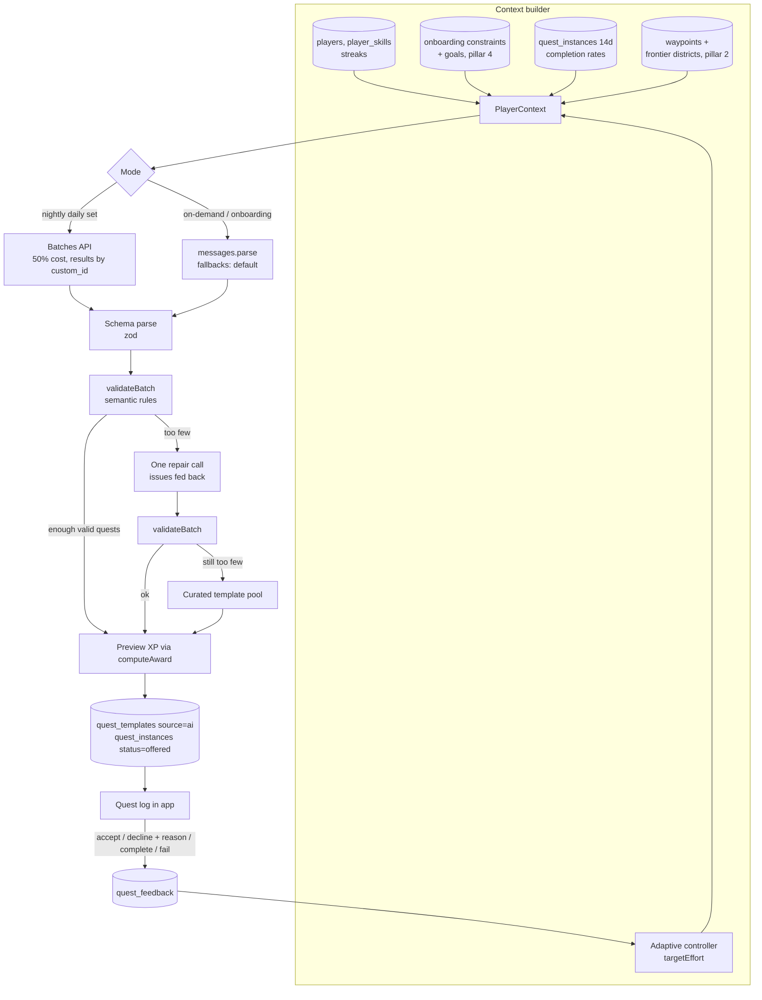

# Life Quest — Pillar 3: AI Quest Generator

Status: v1 draft · Prompt version `qg-2026-10-05.1` · Reference implementation: [`quest-generator.ts`](../src/quests/quest-generator.ts) (typechecks against `@anthropic-ai/sdk` 0.131 + zod 4; validator unit-tested; **no live API call made yet**) · Builds on [pillar 1](./pillar-1-data-models-xp.md) and [pillar 2](./pillar-2-spatial.md)

## 0. Design principles

1. **The LLM designs, the engine prices.** The model outputs tier, effort, skill weights and verification. It never outputs XP. `computeAward()` from pillar 1 does the math, so a prompt change can never inflate the economy.
2. **Two layers of contract.** Structured outputs guarantees the JSON shape (the API constrains decoding to the schema). A semantic validator checks what a schema can't: ids exist, weights sum to 1, no duplicates, tier budget.
3. **Never invent geography.** The model only sees waypoint and district ids we hand it, never coordinates. It can reference places; it can't make them up.
4. **Degrade, don't fail.** Every failure path ends in quests on screen: repair once, then fall back to a curated template pool.
5. **Everything is logged and replayable.** Prompt version, model, full context, raw output, issues and token usage go to `quest_generations`.

## 1. Architecture



## 2. Generation modes

| Mode | Trigger | API | Effort | Count |
|---|---|---|---|---|
| Daily set | Nightly job, 03:00 player-local | Message Batches (50% off), `custom_id = daily:{pid}:{date}` | medium | 3–5 |
| On-demand | "Give me a quest" button | `client.beta.messages.parse` + `fallbacks: "default"` | medium | 1 |
| Main chain | Player adds a goal ("Run a 10K") | `parse`, rolling horizon: generate the next 3 steps, regenerate as steps complete | medium | 3 |
| Exploration | Frontier district within 3 km and Vitality Form < 0.8 | Folded into the daily set | — | 0–1 |
| Onboarding first set | End of pillar 4 flow | `parse`, latency-critical | medium | 3 |

Model: `claude-opus-5-5` (current default). Thinking is adaptive and can't be disabled on this model; `effort` is the cost/quality dial. Refusals: real-time calls use the server-side `fallbacks: "default"` (beta `server-side-fallback-2026-07-01`), which reroutes a declined request inside the same call. Batches don't accept fallbacks, so a refused batch item is re-run on the real-time path.

## 3. The JSON contract

One batch is `{ quests: Quest[] }` (1–8 items). Full zod schema in `quest-generator.ts`. Field by field:

| Field | Type | Notes |
|---|---|---|
| `local_id` | string | Unique in batch; referenced by `prerequisites` |
| `kind` | `daily` · `side` · `main_step` · `exploration` · `boss` | |
| `title` | string ≤ 60 | Imperative + flavor: "Storm the Iron Temple" |
| `flavor_text` | string ≤ 240 | RPG narration, shown on the quest card |
| `objective` | string ≤ 200 | The plain real-world action, shown under the flavor |
| `success` | `{type, target, unit}` | `checkbox` · `count` · `duration_minutes` · `geofence_dwell` · `photo` · `peer_confirm` |
| `tier` | pillar 1 tier enum | Maps to `TIER_BASE_XP` |
| `effort` | 0.5–2.0 | Maps to `effort` in `computeAward` |
| `skill_weights` | `[{skill, weight}]`, 1–3 items | Array, not a map: structured outputs needs `additionalProperties: false` everywhere |
| `verification` | `self` · `evidence` · `sensor` | Declared intent; the server pays on the evidence it actually gets |
| `location` | `{type: none·waypoint·district, ref}` | `ref` must be an id from the context |
| `window` | `{due_in_hours, best_time}` | |
| `estimated_minutes` | int 1–600 | Shown on the card; feeds "fits your schedule" filtering later |
| `prerequisites` | string[] | For chains |
| `chain` | `{main_quest_id, step, of}` or null | |
| `rationale` | string ≤ 300 | Logged for debugging and evals, never shown |

Structured outputs doesn't support `minLength`/`maximum` and similar constraints. The SDK moves them into field descriptions for the model and enforces them client-side when parsing (verified: an `effort` of 3 is rejected at parse).

Mapping to the pillar 1 award:

```typescript
const award = computeAward({
  tier: q.tier,
  effort: q.effort,
  skillWeights: Object.fromEntries(q.skill_weights.map(w => [w.skill, w.weight])),
  verification: actualVerification(instance.evidence, trust), // NOT q.verification
  difficulty: player.difficulty,
  streakDays, repeatIndex, rested, skills,
});
```

## 4. Prompt design

- **System prompt** (frozen, versioned in code as `SYSTEM_PROMPT`): role, design rules, and a short "never" list (no XP numbers; no medical, legal or investment actions beyond everyday habits; nothing dangerous, illegal or involving trespass; no guilt or shame).
- **User turn:** the `PlayerContext` as JSON inside `<player_context>`, followed by one line naming the request. All volatile data lives here so the system prompt is a stable prefix.
- **Prompt caching:** `cache_control` is on the system block. Honest caveat: the v1 system prompt is ~600 tokens, which is likely under the model's minimum cacheable prefix, so caching won't engage until the prompt grows. It will grow: the next iteration adds a style guide and ~6 few-shot example quests per locale, which is both a quality win and pushes the prefix over the threshold.
- **Locale:** the model writes quest text in `ctx.locale`. Turkish and English first.

Context the model sees (abridged):

```json
{
  "locale": "tr-TR", "localTime": "2026-10-05T07:30:00+03:00",
  "difficulty": "hard", "level": 12, "streakDays": 9,
  "skills": { "vitality": {"level": 6, "form": 1.0}, "mindset": {"level": 5, "form": 0.5} },
  "constraints": ["night shifts", "no car"],
  "goals": [{ "id": "g1", "title": "Run a 10K", "horizon": "month" }],
  "completionRate14d": { "minor": 0.9, "standard": 0.6 },
  "targetEffort": 1.1,
  "recentQuestTitles": ["Walk the Moda coastline"],
  "waypoints": [{ "id": "wp_gym", "kind": "gym", "name": "MacFit Kadıköy" }],
  "frontierDistricts": [{ "id": "871ec902effffff", "pctExplored": 0.13, "distanceKm": 1.2 }],
  "request": { "kind": "daily_set", "count": 4 }
}
```

## 5. Validation and repair

`validateBatch()` rules (tested against a mock batch: 5 quests in, 3 kept, 2 auto-corrected):

| Rule | On failure |
|---|---|
| `skill_weights` sum ≈ 1 (±0.05) | Renormalize, log non-fatal |
| `location.ref` exists in context waypoints / districts | Drop quest |
| `geofence_dwell` requires a location | Drop quest |
| `sensor` verification only for `geofence_dwell` / `duration_minutes` | Downgrade to `self`, non-fatal |
| Title not a near-duplicate of the last 14 days (normalized: case, accents, punctuation) | Drop quest |
| `epic` / `boss` only in `main_chain` | Drop quest |
| ≤ 1 `major` per daily set | Drop extras |
| `prerequisites` point at ids in the batch, no self-reference | Drop quest |

If fewer than `request.count − 1` quests survive, one repair call goes out with the issues listed and the surviving titles marked as taken. If that still falls short, fill from the curated pool (`quest_templates WHERE source = 'system'`, filtered by skill and tier, excluding recent). The player never sees an error.

Phase 2: `pg_trgm` similarity > 0.6 for dedupe instead of exact-normalized match.

## 6. Adaptive difficulty

A proportional controller nudges `targetEffort` toward a 70% completion rate, nightly per player:

$$\text{effort}_{t+1} = \text{clamp}_{[0.5,\ 2.0]}\big(\text{effort}_t + 0.5\cdot(\text{completion}_{14d} - 0.70)\big)$$

| 14-day completion | Change |
|---|---|
| 100% | +0.15 |
| 70% | 0 |
| 40% | −0.15 |

Decline reasons from the quest card (`too_hard`, `not_relevant`, `no_time`, `already_doing_it`) are passed into the context as counts, so the model adjusts content, not just size.

## 7. Schema additions

```sql
CREATE TABLE quest_generations (
  id               uuid PRIMARY KEY DEFAULT gen_random_uuid(),
  player_id        uuid NOT NULL REFERENCES players(id) ON DELETE CASCADE,
  mode             text NOT NULL CHECK (mode IN ('daily','on_demand','main_chain','onboarding','repair')),
  prompt_version   text NOT NULL,
  model            text NOT NULL,                 -- response.model (records fallback if one ran)
  batch_id         text,                          -- Message Batches id, nightly only
  context          jsonb NOT NULL,
  raw_output       jsonb,
  issues           jsonb NOT NULL DEFAULT '[]',
  kept_count       smallint NOT NULL DEFAULT 0,
  used_pool        boolean NOT NULL DEFAULT false,
  stop_reason      text,
  input_tokens     int, output_tokens int, cache_read_tokens int,
  created_at       timestamptz NOT NULL DEFAULT now()
);
CREATE INDEX ON quest_generations (player_id, created_at DESC);

ALTER TABLE quest_templates ADD COLUMN generation_id uuid REFERENCES quest_generations(id);
ALTER TABLE quest_templates ADD COLUMN content jsonb;  -- the full validated Quest object

CREATE TYPE quest_feedback_signal AS ENUM ('accepted','declined','completed','failed','reported');
CREATE TABLE quest_feedback (
  quest_instance_id uuid REFERENCES quest_instances(id) ON DELETE CASCADE,
  signal            quest_feedback_signal NOT NULL,
  reason            text,                         -- too_hard | not_relevant | no_time | already_doing_it | unsafe
  at                timestamptz NOT NULL DEFAULT now(),
  PRIMARY KEY (quest_instance_id, signal)
);
```

A `reported` signal with reason `unsafe` hides the quest immediately and flags the generation for review.

## 8. Cost (estimate, not measured)

Rough per daily set: ~2k input tokens, ~1k output plus adaptive thinking at medium effort. At `claude-opus-5-5` batch pricing (50% off $4 / $20 per MTok) that's on the order of **$0.02–0.04 per player per day**, so roughly $1 per daily active user per month. Levers, in order, once real usage is logged: prompt caching (after the few-shot examples land), `effort: "low"` for daily sets if the eval holds quality, then a cheaper model for daily sets only, which is a product call for you.

## 9. Decisions I made (change any of these)

- **Claude Opus 5.5** as the generator, with batch for the nightly bulk.
- **Daily sets are generated overnight**, not on app open: zero latency in the morning and half the cost.
- **Main chains use a rolling 3-step horizon** instead of planning the whole goal up front, so the chain adapts to how the player is actually doing.
- **70% completion target.** Lower feels punishing; higher means quests are too easy to matter.

## 10. Next in this pillar

- **Eval set:** ~30 player archetypes (night-shift nurse, student, new parent, retiree…) × request kinds, scored on validity rate, constraint violations, duplicates, and an LLM-judge for "would this person actually do it". Required before any prompt or model change.
- First live run against the API to measure real token usage and replace the estimate in §8.
- Few-shot example library per locale (also unlocks caching).
