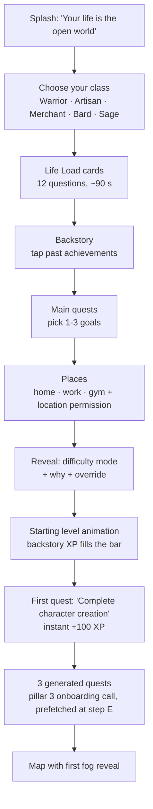

# Life Quest — Pillar 4: Onboarding & Difficulty Calibration

Status: v1 draft · Calibration version `1` · Reference implementation: [`calibration.ts`](../src/onboarding/calibration.ts) (typechecked with `xp-engine.ts`, tested against 6 personas) · Feeds [pillar 1](./pillar-1-data-models-xp.md) (mode, starting XP) and [pillar 3](./pillar-3-ai-quest-generator.md) (constraints, goals, starting effort)

## 0. Design principles

1. **Difficulty measures the player's life, not their skill.** A single parent on night shifts is playing on Hard whether or not they're fit. That's what earns them the XP multiplier.
2. **Character creation, not a medical intake.** ~3 minutes, one question per card, swipe or tap, every question skippable (skips score as 0 load).
3. **No one starts high.** Backstory XP is capped at level 8, so everyone gets the fast early level-ups that hook them.
4. **Harder is allowed; inflated XP is not.** A player can pick a tougher mode for the challenge, but the XP multiplier never exceeds what their calibrated life load earns.
5. **Sensitive answers stay sensitive.** Health and money answers are special-category data under GDPR and Turkey's KVKK. The server keeps derived scores and tags, not raw answers.

## 1. Flow



The pillar 3 call fires in the background as soon as goals are picked (step E), so the first quests are ready by the time the reveal animation ends.

## 2. Screens

| # | Screen | Layout | Interaction | Haptics |
|---|---|---|---|---|
| B | Class select | 5 tall cards in a horizontal carousel, class art + skill icon + "+5% {skill} XP" | Swipe, tap to select | `.selection` on snap, `.medium` on select |
| C | Life Load cards | One full-screen card per question, progress pips at top, big tap targets in the bottom 40% | Tap option → card flies off; swipe down to go back; "Skip" text button | `.light` on each answer |
| D | Backstory | 18 achievement chips in a wrap grid grouped by skill color | Multi-select; each tap adds XP to a live counter | `.light` per chip, counter ticks |
| E | Main quests | 12 suggested goals + "Write your own" field; horizon pill (week / month / year) | Pick 1–3 | `.medium` on pick |
| F | Places | Map with a pin drop for home, work, gym; each optional | Long-press to drop; permission primer before the OS prompt | `.medium` on drop |
| G | Mode reveal | Mode emblem, Life Load gauge, 2–3 lines on why ("long hours, young kids, short sleep"), mode table, "Choose differently" link | Tap to accept or override | Custom pattern: rising 3-pulse, then `.success` |
| H | Level-up | Full-screen XP bar fills from 0 to backstory total, level number ticks up | Auto, tap to skip | `.rigid` per level gained |

Copy tone on G: never "you have it hard". Say "Your world is on Hard. Every quest you finish here counts for more."

## 3. Life Load scoring

Five domains, each capped, summed and clamped to 0–100.

| Domain | Inputs | Cap |
|---|---|---|
| Time | Work hours (0 / 4 / 12 / 16 / 20), shift work +5, commute (0 / 2 / 4 / 6), kids under 5 × 8 + older kids × 3 (cap 14), adult caregiving +8 | 35 |
| Money | Income stable 0 / variable 5 / precarious 10, plus debt stress 0–4 × 2.5 | 20 |
| Health | Limitation none 0 / mild 6 / significant 12, plus sleep (<5 h: 8, 5–6: 5, 6–7: 2, 7+: 0) | 20 |
| Life events (12 months) | Bereavement 8, breakup 7, job loss 7, serious illness 7, new baby 6, caring crisis 6, move 3, new job 3, exams 3 | 15 |
| Support | People you can count on, 0–4 × −1.5 | −6 |

Mode thresholds:

| Life Load | Mode | XP mult (pillar 1) | Starting `targetEffort` (pillar 3) |
|---|---|---|---|
| 0–11 | Peaceful | 0.8 | 1.1 |
| 12–34 | Normal | 1.0 | 1.0 |
| 35–54 | Hard | 1.2 | 0.9 |
| 55+ | Hardcore | 1.4 | 0.8 |

Harder modes start at lower effort: their quests are smaller, but each pays more.

### Persona check (output of `calibrate()`)

| Persona | Life Load | Mode | Start level | Constraint tags |
|---|---|---|---|---|
| Retiree, 67, mild health limits, 6 achievements | 2 | Peaceful | 7 | 2 |
| Office worker, 30, 20–40 h, degree | 14 | Normal | 4 | 1 |
| Student, 20, part-time, exams | 17 | Normal | 1 | 1 |
| New parent, 31, baby, < 5 h sleep | 36 | Hard | 5 | 3 |
| Founder, 34, 50+ h, picked Hardcore | 40 | Hard (plays Hardcore rules, Hard XP) | 7 | 4 |
| Night-shift nurse, 38, single parent, recent divorce | 58 | Hardcore | 6 | 7 |

I tuned the weights until these landed where a reasonable person would put them. The first version put the office worker on Peaceful because the support offset was too strong.

## 4. Override rules

```typescript
// From calibration.ts
resolveMode("hard", "hardcore")  // → { rulesMode: "hardcore", xpMode: "hard" }
resolveMode("hard", "peaceful")  // → { rulesMode: "peaceful", xpMode: "peaceful" }
resolveMode("normal", "hardcore") // → { rulesMode: "hard", xpMode: "normal" }  (max one step up)
```

- **Easier:** any mode, no friction. Rules and XP both drop.
- **Harder:** one step above calibrated. Streak rules follow the chosen mode; the XP multiplier stays at the calibrated mode's.
- `players.difficulty` stores `xpMode`; a new `players.rules_mode` column stores `rulesMode`.

## 5. Backstory (starting XP)

18 achievements, each worth 300–700 XP to one skill (full table in `calibration.ts`), plus life experience: 40 XP per adult year up to 20 years, split across all five skills.

- Per-skill cap: XP to reach skill level 6.
- Total cap: XP to reach player level 8 (scaled down proportionally if exceeded).
- Granted through the pillar 1 ledger with idempotency key `backstory:{pid}:{code}`, so recalibration can't grant it twice.
- Not verified. It's capped low enough that lying buys a few early levels, which the curve makes up in about a week.

## 6. Output to the other pillars

`calibrate(answers)` returns everything downstream needs:

```typescript
{
  version: 1,
  lifeLoad: { total: 58, domains: { time: 35, money: 12.5, health: 5, events: 7, support: -1.5 } },
  calibratedMode: "hardcore", rulesMode: "hardcore", xpMode: "hardcore",
  startingLevel: 6,
  startingSkillLevels: { vitality: 2, craft: 2, wealth: 2, charisma: 2, mindset: 6 },
  backstory: { perSkill: { ... }, total: 1818 },
  targetEffort: 0.8,                       // → pillar 3 PlayerContext.targetEffort
  constraints: [                           // → pillar 3 PlayerContext.constraints
    "works night or rotating shifts", "long commute", "young children at home",
    "tight budget, prefer free activities", "short on sleep", "no car, uses public transit",
    "going through a hard period, favor gentle and restorative quests"
  ],
  classNode: "mindset.still_mind"          // → player_skill_nodes
}
```

Goals from screen E become `player_goals` rows and flow into `PlayerContext.goals`. Places from screen F become private `waypoints` (pillar 2) of kind `home`, `work`, `gym`.

## 7. Schema additions

```sql
ALTER TABLE players ADD COLUMN rules_mode difficulty_mode NOT NULL DEFAULT 'normal';
ALTER TABLE players ADD COLUMN class text CHECK (class IN ('warrior','artisan','merchant','bard','sage'));

CREATE TABLE calibrations (
  id                   uuid PRIMARY KEY DEFAULT gen_random_uuid(),
  player_id            uuid NOT NULL REFERENCES players(id) ON DELETE CASCADE,
  version              smallint NOT NULL,
  trigger              text NOT NULL CHECK (trigger IN ('onboarding','scheduled','life_event','drift')),
  life_load            smallint NOT NULL,
  domains              jsonb NOT NULL,          -- derived scores only, no raw answers
  calibrated_mode      difficulty_mode NOT NULL,
  rules_mode           difficulty_mode NOT NULL,
  xp_mode              difficulty_mode NOT NULL,
  constraint_tags      text[] NOT NULL,
  created_at           timestamptz NOT NULL DEFAULT now()
);
CREATE INDEX ON calibrations (player_id, created_at DESC);

CREATE TABLE player_goals (
  id               uuid PRIMARY KEY DEFAULT gen_random_uuid(),
  player_id        uuid NOT NULL REFERENCES players(id) ON DELETE CASCADE,
  title            text NOT NULL,
  horizon          text NOT NULL CHECK (horizon IN ('week','month','year')),
  status           text NOT NULL DEFAULT 'active' CHECK (status IN ('active','completed','abandoned')),
  created_at       timestamptz NOT NULL DEFAULT now(),
  completed_at     timestamptz
);
```

Raw answers live only on the device (encrypted local storage), so the player can re-open and edit them during recalibration. Server stores `domains` and `constraint_tags`. Explicit consent screen before the health and money cards, with "Skip these" as an equal-weight button.

## 8. Recalibration

| Trigger | Rule |
|---|---|
| Scheduled | Allowed every 30 days (pillar 1 decision). Prefilled with last answers; ~30 s. |
| Life event | "Something changed?" in the profile, any time. Pick the event; only the affected cards are re-asked. Bypasses the 30-day lock once per 30 days. |
| Drift | If the pillar 3 controller sits at `targetEffort` 0.5 and 14-day completion stays under 40% for 3 weeks, prompt: "Life getting heavier? Recalibrate." Never automatic. |
| Upward drift | Completion above 90% at `targetEffort` 2.0 for 3 weeks → offer a one-step harder rules mode (XP unchanged). |

A mode change applies from the next local midnight. Past XP is never recomputed.

## 9. Decisions I made (change any of these)

- **Classes** give +5% XP in one skill and nothing else, so they're flavor and focus, not a power choice.
- **Age** only adds life-experience XP; it doesn't affect difficulty. Age alone doesn't make life harder.
- **Every question is skippable**, scoring 0. A player who skips everything lands on Peaceful and can recalibrate later.
- **Health and money questions stay**, behind consent, because they're the biggest real drivers of how much capacity someone has.

## 10. Next in this pillar

- Localized copy (Turkish and English) for all 12 cards and the mode reveal.
- Clickable prototype of the onboarding flow to time it with real people (target under 3 minutes).
- Check thresholds against real calibration data after the first ~200 players, and adjust so the mode split is roughly 15 / 45 / 30 / 10.
